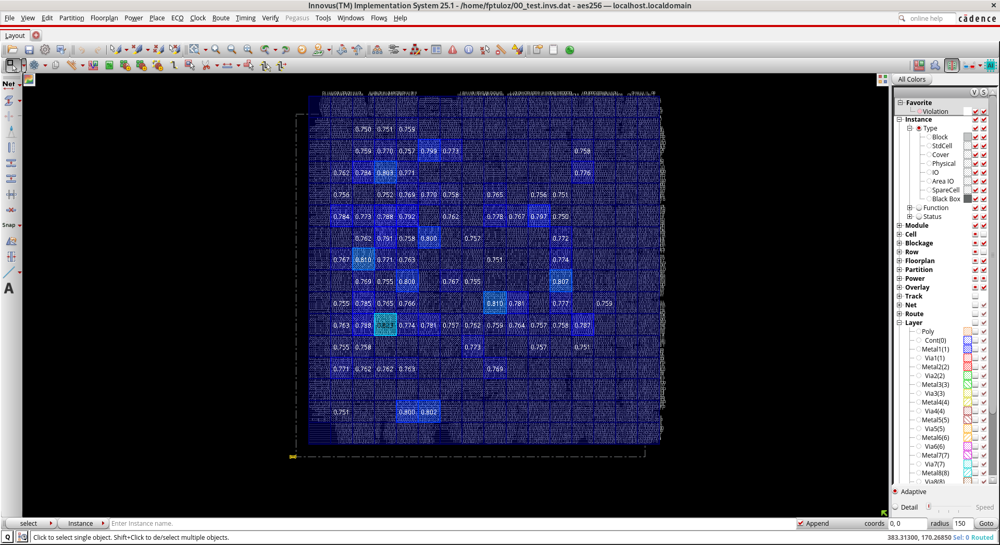

# AES-256_GDSII
# 🚀 Báo cáo Physical Design - Dự án AES-256 (GDSII)

## 📖 Mô tả dự án
Dự án thực hiện luồng thiết kế vật lý (Physical Design) cho lõi mã hóa AES-256. Toàn bộ quy trình được triển khai trên môi trường hệ điều hành AlmaLinux, sử dụng công cụ EDA Cadence Innovus. Mục tiêu của dự án là hoàn thiện layout từ file Netlist đầu vào cho đến bước xuất file GDSII cuối cùng, đảm bảo tối ưu các tiêu chí khắt khe về Timing (WNS, TNS), Power, và không có vi phạm DRC/LVS.

---

## 🚧 Cập nhật trạng thái tiến độ
*Đánh dấu `[x]` vào các ô trống khi hoàn thành từng giai đoạn.*

- [x] Khởi tạo dự án, Import Design & cấu hình `.gitignore`.
- [ ] **Phase 1: Floorplan** (Đang thực hiện)
- [ ] **Phase 2: Placement** (Chưa bắt đầu)
- [ ] **Phase 3: Clock Tree Synthesis - CTS** (Chưa bắt đầu)
- [ ] **Phase 4: Routing & Sign-off** (Chưa bắt đầu)

---

## 📊 Phân tích Report các giai đoạn
*(Mục này dùng để ghi chú lại thông số kỹ thuật chính sau mỗi lần chạy Innovus)*

### 1. Floorplan
- **Mục tiêu:** Sắp xếp các Macro, xác định viền Core/Die, thiết kế mạng lưới nguồn (Power Grid).
- **Phân tích:** 
  - Mật độ lõi (Core Density): `... %`
  - Tình trạng IR Drop dự kiến: `...`
  - Link ảnh báo cáo: 

### 2. Placement
- **Mục tiêu:** Sắp xếp các Standard Cells.
- **Phân tích:** 
  - Tình trạng tắc nghẽn (Congestion): `...` (Có điểm nóng/hotspot nào không?)
  - Timing sơ bộ (Pre-CTS WNS/TNS): `... ns`

### 3. Clock Tree Synthesis (CTS)
- **Mục tiêu:** Xây dựng cây đồng hồ, cân bằng độ trễ.
- **Phân tích:** 
  - Clock Skew: `... ps`
  - Insertion Delay: `... ps`
  - Timing sau CTS: `... ns`

### 4. Routing & Sign-off
- **Mục tiêu:** Đi dây tín hiệu thực tế và kiểm tra quy tắc vật lý.
- **Phân tích:** 
  - Vi phạm DRC (Design Rule Check): `... lỗi`
  - Vi phạm LVS (Layout vs Schematic): `... lỗi`
  - Post-Route Timing (WNS cuối cùng): `... ns`

---

## 💡 Sổ tay lệnh GitHub & Lưu ý hệ thống (Cheatsheet)

### 1. Quy tắc an toàn dữ liệu (Sống còn)
Tuyệt đối **KHÔNG** push các file rác hoặc database nặng của Innovus lên GitHub. File `.gitignore` ở thư mục gốc đã được thiết lập để tự động chặn các định dạng nguy hiểm:
* Cấm file Database: `*.enc`, `*.enc.dat/`, `.invs`
* Cấm file Log/Command: `*.log`, `*.cmd`, `innovus.log*`

### 2. Vòng lặp Nộp Report hàng ngày
Khi có report `.rpt` mới hoặc ảnh chụp màn hình GUI, mở Terminal và chạy tuần tự 3 lệnh:

```bash
# 1. Gom tất cả các file mới (Git sẽ tự động lọc rác nhờ .gitignore)
git add .

# 2. Ghi chú lại phiên bản (Thay đổi text bên trong ngoặc kép)
git commit -m "report(floorplan): cap nhat anh density va file summary"

# 3. Đẩy lên GitHub
git push origin main
